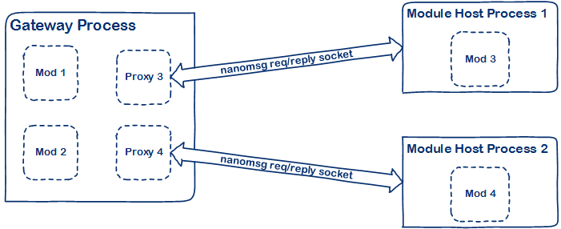
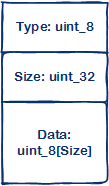

On out process gateway modules
==============================

Introduction
------------

All modules in the gateway are hosted within the gateway process today. While
this makes for great performance it is also at the cost of execution isolation
between modules, i.e., one misbehaving module can potentially affect the
behavior of other modules or the gateway itself. This document seeks to propose
a design for implementing gateway modules that are hosted in external processes.
These processes may execute on the same device that the gateway is running on or
on remote devices.

Design Goals
------------

One key design goal is the notion that developers who are implementing modules
should not have to do anything special in order to have their module hosted
outside the gateway process. All the complexities of activation and
inter-process communication should be transparently handled by the gateway
framework.

Design Non-goals
----------------

It is possible that an out-proc module, due to implementation issues (aka bugs),
becomes unstable and precipitates a process hang or termination. In such cases
the gateway *will not* seek to automatically restart the process or attempt
recovery in some way. It is assumed that mechanisms external to the gateway will
be used for this purpose.

Inter-process Communication
---------------------------

The inter-process communication between the gateway process and the process
hosting the module will be managed using **nanomsg**
[request/reply](http://nanomsg.org/v1.0.0/nn_reqrep.7.html) sockets. Each
process will create an `NN_REP` socket and continuously listen for messages on
it. In this respect, each process is a server and a client of each other. The
endpoints that these sockets listen on will be specified via configuration.
Given that *nanomsg* supports multiple transports, having a module run on a
remote device is simply a matter of using, say, a
[TCP](http://nanomsg.org/v1.0.0/nn_tcp.7.html) transport. The transport
configuration will be read from a settings file and will therefore be
configurable at runtime.

Proxy Module
------------

The first piece of the puzzle is a gateway module (i.e., it implements
`Module_Create`, `Module_Receive` and `Module_Destroy`) that we shall call the
*proxy* module. The job of the proxy module is to abstract from the rest of the
gateway the fact that the module in question is running outside the gateway
process, i.e., as far as the rest of the gateway is concerned, the out-proc
module is no different from the garden variety in-proc module. The proxy
module’s out-proc counterpart is a *hosting process* that is responsible for
running the remote module in question and broker communication between that
module and the gateway.

### Proxy Module Configuration

The proxy module’s configuration JSON will include the following information:

-   **Listen URL**

    The URL that the proxy module should listen for messages on. This will be a
    *nanomsg* URL - for e.g., `ipc://mod1_proxy`.

-   **Remote URL**

    The URL that the hosting process is listening for messages on. This is
    again, a *nanomsg* URL.

-   **Activation Type**

    This is an enumeration with values indicating how the hosting process will
    be activated. It could indicate one of the following possible values:

    -   **None:** An activation type of **None** indicates that the proxy module
        does not have to do anything in particular to *activate* the module. The
        expectation is that out-of-band measures will be adopted to ensure that
        the out-proc module will be activated.

    -   **Fork:** An activation type of **Fork** means that the proxy module
        will attempt to fork the hosting process when the module is initialized.
        The proxy will wait for a fixed duration in order to let the remote
        process complete initialization and start listening on it’s `NN_REP`
        socket. Additional context information is supplied as part of the
        configuration:

        -   *Host Path*: Path to the executable that will host the module in
            question

        -   *Configuration Path*: Path to the configuration file that is to be
            passed as a command line parameter to the host process. Information
            on what this configuration file will include is discussed elsewhere
            in this document.

    -   **Service:** This activation type indicates that the module host is a
        service and the proxy is expected to *start* the service during
        initialization. The configuration might indicate whether this is an
        *upstart* or *systemd* or a Windows system service.

    -   **Container:** This activation type indicates that the out-proc module
        is hosted in a Docker container and needs to be started during
        initialization.

-   **Module Configuration**

    The configuration information to be used by the remote module to initialize
    itself. This is sent across to the module host when it is created.

To begin with we might choose to support only the **None** and the **Fork**
activation types.

The proxy module will create a *nanomsg* `NN_REP` socket and listen for messages
on it. It will also create an `NN_REQ` socket and connect to the remote process.
Once a connection with the module host process has been established
communication will commence as explained later in this document.

Module Host
-----------

The module host is an executable whose primary function is to load the gateway
module in question and broker communication between the module and the gateway
process. It is passed the path to a configuration file as a command line
parameter. The module host then proceeds to do the following:

-   Load configuration information from the file passed on the command line

-   Construct a handle that implements the `Broker_Publish` API

-   Load the gateway module into memory

-   Open a *nanomsg* `NN_REP` socket and start listening for messages

-   Open a *nanomsg* `NN_REQ` socket to the proxy module in the gateway process

### Configuration

The configuration file for the module host will include the following
information:

-   **Listen URL**

    The *nanomsg* URL that the module host process should listen for messages
    on.

-   **Remote URL**

    The *nanomsg* URL of the proxy module in the gateway process.

-   **Module Path**

    The path to the module that is to be loaded and hosted.

Proxy/Module Host Communication Protocol
----------------------------------------

The proxy and the module host communicate via *messages* using *nanomsg*
request/reply sockets. The different message types and how they work has been
described below. The ordering of the message types given below corresponds
roughly with the sequence in which these messages are sent and received. Each
message packet is structured like so:

-   **Create Module Request**

    This message is sent by the proxy to the module host after it establishes a
    socket connection. The *data* in the packet is the configuration JSON string
    serialized as a length prefixed UTF-8 encoded string. The module host is
    expected to de-serialize the string and invoke `Module_Create` passing the
    parsed JSON representation.

-   **Create Module Reply**

    This message is sent by the module host in response to a *Create Module*
    request from the proxy. The *data* in the packet is a boolean status
    indicating whether the module creation was successful or not.

-   **Message Receive Request**

    This message is sent by the proxy to the module host whenever a message is
    received from the message broker. The `MESSAGE_HANDLE` is serialized as a
    byte stream and sent as the *data* of the packet. No reply is expected from
    the module host for this message. The module host is expected to invoke
    `Module_Receive` on the module.

-   **Message Publish Request**

    This message is sent by the module host to the proxy whenever the module
    hosted by it invokes `Broker_Publish`. The *data* is a serialized
    representation of the `MESSAGE_HANDLE`. The proxy is expected to
    de-serialize and publish the message to the message broker. No reply is
    expected from the proxy for this message.

-   **Destroy Module Request**

    This message is sent by the proxy to the module host when the module is
    being shut down. There is no *data* associated with this message and no
    reply is expected to be sent by the module host. The module host is expected
    to invoke `Module_Destroy` on the module and quit the process.

Open Questions
--------------

1.  Instead of a “proxy module” should we make the notion of out-proc modules a
    core gateway concept? This would mean that instead of listing the out-proc
    modules like another module, we might come up with configuration options
    that natively declare out-proc modules.

2.  As proposed here, a single module host process will only host a single
    module. Do we want a “medium” isolation option where multiple modules can be
    hosted in a single process?

3.  If the module host process unexpectedly terminates, the proxy does not
    currently attempt to restart it. Should we include this ability in the
    design?

4.  If the gateway process unexpectedly terminates, there could be orphan module
    host processes lying around. Should we handle this case?

5.  What would be a good timeout for the proxy when it is sitting around waiting
    for the module host to get its act together? If there is a timeout or a
    connection failure, should the proxy retry the connection? If yes, how many
    times? Should it implement exponential back-off?

6.  As of today, the module build scripts link statically with the gateway code.
    This means that `Broker_Publish` is linked in to the module binary. We may
    need to build the broker functionality as a DLL/SO and have different
    implementations loaded at runtime depending on whether a module is being
    hosted in-proc in a gateway process or inside a module host process. Is this
    doable?

7.  The message serialization format is expected to be cross-platform. Is this
    actually the case? Has this been tested?

8.  Should the module host and the proxy module establish a protocol for
    exchanging periodic heartbeat messages to gauge the health of each process?

9.  In case the module host is running on a separate device how will the
    communication between them be secured? Does *nanomsg* support TLS
    encryption?

Alternate Approach - Reusing Broker’s Nanomsg Socket
----------------------------------------------------

The topic based routing implementation of the message broker today uses a
*nanomsg* socket for supporting publish/subscribe communication semantics. Given
that there is already a *nanomsg* socket, the idea is to explore whether we can
simply tack-on a TCP (or IPC) transport endpoint to it and communicate directly
with it from the module host. While this approach works it does not appear to
obviate the need for:

1.  Having a *proxy* module that represents the module being hosted in the
    external process because we’d still need a way of *activating* the remote
    module which, with a proxy module, we could implement from the
    `Module_Create` API.

2.  Establishing a separate *control* channel between the proxy module and the
    module host process since the proxy will still need to communicate the
    following information to the module host:

    1.  The *nanomsg* endpoint URL at which the broker is listening for messages

    2.  The topic name to use for publishing messages to the broker

    3.  The topic names that the remote module should subscribe to

    If the activation type chosen is *fork*, then we might conceivably pass this
    information via the command line. If other activation types were chosen
    however then we would need to have a control channel to pass this
    configuration data. Also, even when the activation type is *fork*, when the
    Gateway SDK gains the ability to dynamically add new modules, new
    subscriptions that may now be in effect will need to be passed to the remote
    module which, again, requires that there be a control channel which can be
    used for this purpose.

This approach also requires that the broker use topic names for each module read
from configuration instead of using pointer values as it currently does. This is
needed so that the module host knows what topic to publish to when the module
calls `Broker_Publish`.

With this approach we discover that the module host ends up having to
re-implement a non-trivial portion of the broker in it’s *proxy broker*
implementation. It will for instance, need to re-implement the message loop that
reads from the *nanomsg* subscribe socket, strip out the topic name from the
message and deserialize and deliver the message to the module. Similarly, when
the module calls `Broker_Publish` the proxy broker will need to serialize the
message into a byte array and prefix it with the correct topic name. All of this
is functionality that the broker in the gateway already implements.

The take away appears to be that while this can be made to work, having a
separate proxy module and control channel seems to lend itself to a cleaner,
more natural implementation.
